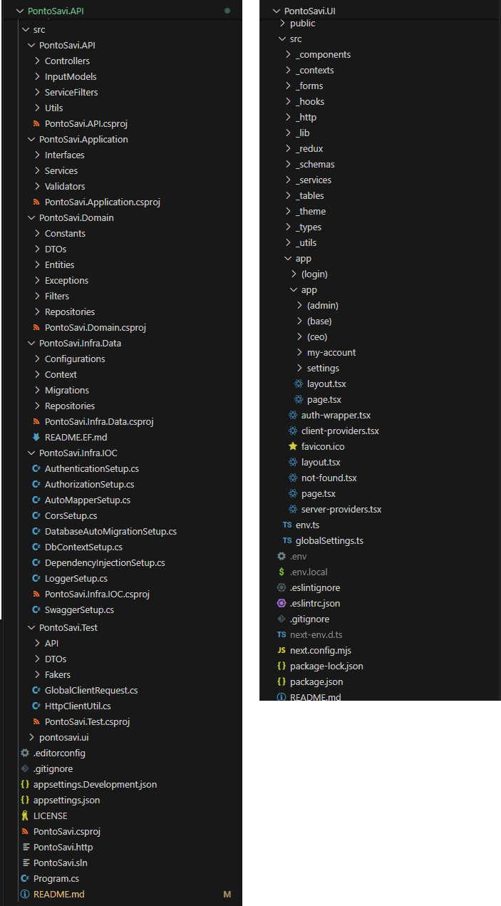

  

    
    <h1 style="color: #ffffff;" align="center">PontoSavi - Lovelace Lines</h1>
  

Bem-vindo ao repositório do PontoSavi, um aplicativo desenvolvido em .NET 8 + Next.js para gerenciar e controlar o registro de ponto dos funcionários. Este sistema foi projetado para atender às necessidades de empresas de pequeno portes, oferecendo uma solução segura e eficiente para o controle de jornadas de trabalho.

Nosso sistema oferece autenticação segura, apenas funcionários autorizados podem realizar o acesso. Há diferentes níveis de acesso: usuários comuns podem registrar horários de entrada e saída, solicitar correções e visualizar seus registros; gestores têm a capacidade de aprovar correções de ponto e solicitações de horas extras; e administradores podem configurar turnos, feriados e realizar o gerenciamento geral do sistema.

O registro de ponto é facilitado, permitindo que os usuários registrem horários de entrada e saída de maneira intuitiva. Em caso de erros, o sistema possui um fluxo de aprovação para correções de ponto e horas extras, garantindo que todas as alterações sejam revisadas e aprovadas por um gestor.

Para configurar jornadas de trabalho, o sistema permite a definição de diferentes turnos e suporte para jornadas fixas. Também é possível configurar feriados e dias não trabalhados, bem como definir políticas de tolerância para registros de entrada e saída, permitindo uma margem de minutos de flexibilidade.

Além disso, os dados podem ser exportados em diversos formatos, como Excel, PDF, CSV e JSON, facilitando a análise e o compartilhamento de informações.

Contribuições para o projeto são bem-vindas! Se você deseja colaborar, sinta-se à vontade para abrir issues e enviar pull requests.

Este projeto está licenciado sob a MIT License, permitindo que você use, copie e modifique conforme necessário.

## Principáis tecnologias utilizadas

### .Net

O .NET é uma plataforma de desenvolvedor multiplataforma de código aberto gratuita para criar muitos tipos diferentes de aplicativos. O ASP.NET amplia a plataforma de desenvolvedor do .NET com ferramentas e bibliotecas específicas para a criação de aplicativos web. O C# é sua principal linguagem de programação, simples, moderna, com foco no objeto e de tipo seguro. 

Bibliotecas utilizadas no desenvolvimento:

| [ASP.Net](https://www.nuget.org/packages/Microsoft.AspNetCore.OpenApi) | [Entity Framework](https://www.nuget.org/packages/Microsoft.EntityFrameworkCore) | [AutoMapper](https://www.nuget.org/packages/AutoMapper) | [Bogus](https://www.nuget.org/packages/Bogus) | [FluentValidation](https://www.nuget.org/packages/FluentValidation) | [Serilog](https://www.nuget.org/packages/Serilog) | [xunit](https://www.nuget.org/packages/xunit) | [JWT](https://www.nuget.org/packages/Microsoft.AspNetCore.Authentication.JwtBearer)
|:--:|:--:|:--:|:--:|:--:|:--:|:--:|:--:|
|  |  |  |  |  |  |  | 

### Next.js/React

O React é uma biblioteca JavaScript para criar interfaces de usuário (UI) reativas baseado no conceito de componentes, que são blocos de construção reutilizáveis que podem ser combinados para criar interfaces complexas. uma biblioteca popular para criar aplicativos web, incluindo sites, aplicativos móveis e aplicativos de desktop.

Bibliotecas utilizadas no desenvolvimento:

| [Next.js](https://nextjs.org/) | [React](https://react.dev/) | [MUI](https://www.npmjs.com/package/@mui/material) | [Redux](https://redux-toolkit.js.org/) | [Material React Table](https://material-react-table.com/) | [Axios](https://www.npmjs.com/package/axios) | [ESLint](https://www.npmjs.com/package/eslint) | [Zod](https://zod.dev/) | [JWT-Decoder](https://www.npmjs.com/package/jwt-decode) | [React Hook Form](https://www.npmjs.com/package/react-hook-form) | [React Icons](https://react-icons.github.io/react-icons/) | [Excel-Ent](https://github.com/leoreisdias/excel-ent) | [export-from-json](https://github.com/zheeeng/export-from-json) | [export-to-csv](https://www.npmjs.com/package/export-to-csv)  | [jsPDF](https://www.npmjs.com/package/jspdf)
|:--:|:--:|:--:|:--:|:--:|:--:|:--:|:--:|:--:|:--:|:--:|:--:|:--:|:--:|:--:
|  |  |  |  |  |  |  |  |  |  |  |  |  |  | 

## Diagramas

Para modelar e representar a estrutura lógica dos dados, é utilizado o **Diagrama de Entidade-Relacionamento**, proporcionando uma visão clara e concisa das relações e da organização dos dados dentro do banco de dados.

O projeto esta sobre a Clean Architecture, visando testabilidade, flexíveis e separação de responsabilidades. Essa abordagem de arquitetura de software promove a separação clara e distinta das responsabilidades em diferentes camadas, permitindo que cada uma delas evolua de forma independente.

## Showcase

### UI

### API

